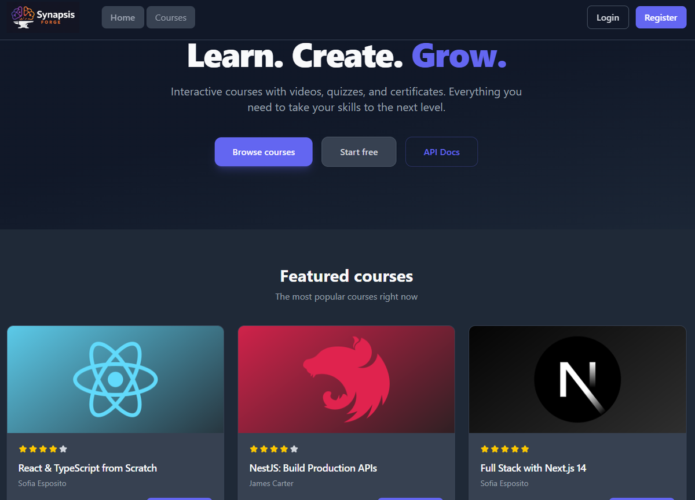
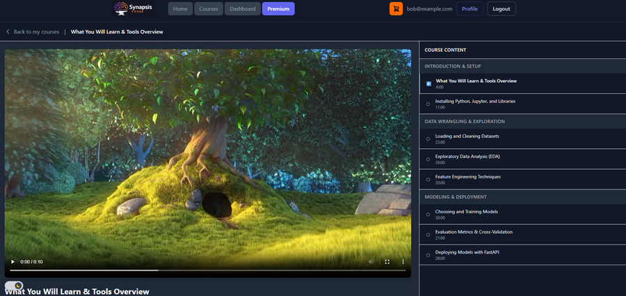
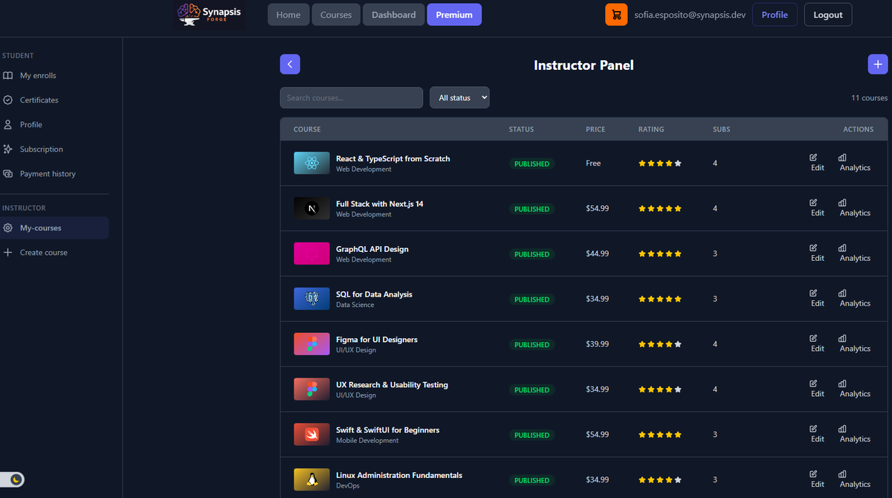
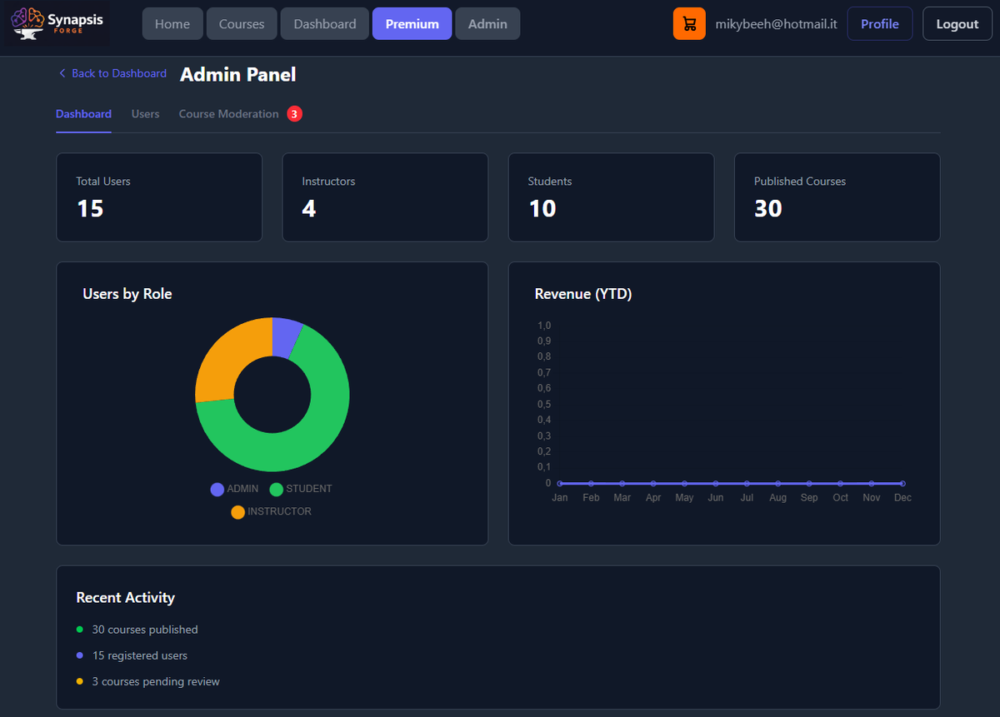
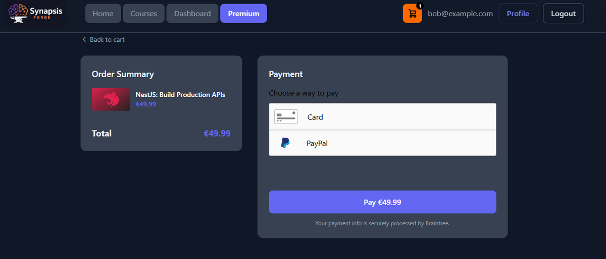
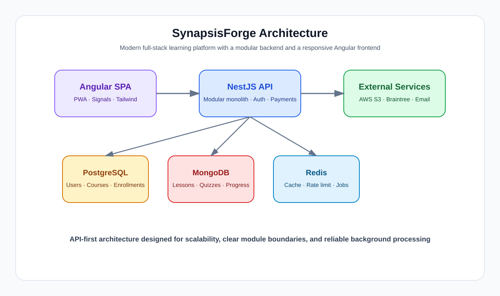
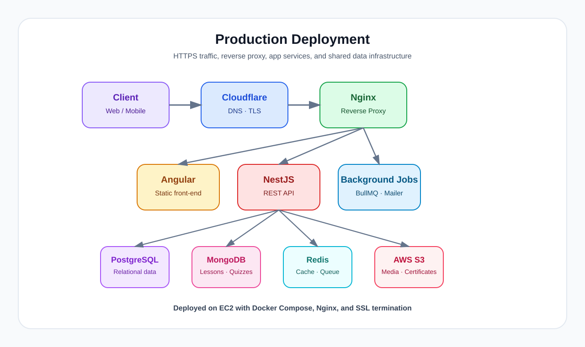

# SynapsisForge

> Enterprise-oriented full-stack e-learning platform designed to showcase advanced software engineering, backend architecture, frontend engineering, authentication systems, cloud integrations, and DevOps workflows.

[](https://gitlab.com/SuperPorz/synapsisforge)
[](LICENSE)
[](https://angular.dev)
[](https://nestjs.com)

**Live**: [https://synapsisforge.shop](https://synapsisforge.shop)  
**API**: `https://synapsisforge.shop/api`  
**Swagger**: `https://synapsisforge.shop/api/docs`  
**Bull Board**: `https://synapsisforge.shop/admin/queues` (admin only)

---

## Quick Start — Local Setup

1. Clone the repository:

```bash
git clone https://github.com/SuperPorz/SynapsisForge.git
cd SynapsisForge
```

> Optional: run `npm install` in `backend/` and `frontend/` if you need native tooling (linting, tests, typecheck). The Docker images install dependencies automatically.

2. Create the development environment file:

```bash
cp .env.example .env.development
```

Fill in at least `JWT_ACCESS_SECRET` and `JWT_REFRESH_SECRET` in `.env.development` — the Docker compose file pre-configures database and service credentials for PostgreSQL, MongoDB, and Redis.

3. Start the full development stack with Docker Compose:

```bash
docker compose -f infra/docker-compose-dev.yaml up -d --build
```

4. Seed demo data (runs inside the Docker container):

```bash
docker compose -f infra/docker-compose-dev.yaml exec backend npx ts-node src/database/seeds/seed.ts
```

5. Open the app:

| Service | URL |
|---------|-----|
| Frontend | http://localhost:8080 |
| Backend API | http://localhost:3000 |
| Swagger UI | http://localhost:3000/api/docs |

> The development compose file already builds and runs the frontend, backend, nginx, PostgreSQL, MongoDB, and Redis. You usually do not need to start backend and frontend manually when using this stack.

---

## Screenshots

A few representative views of the platform in action:











> Screenshots are stored in the screenshots/ directory and reflect the current product experience. Live demo: [synapsisforge.shop](https://synapsisforge.shop).

---

## Architecture



SynapsisForge is built around a modular monolith backend and a modern Angular frontend, with PostgreSQL, MongoDB, Redis, AWS S3, and Braintree providing the core services and integrations.

## Tech Stack

### Frontend

- **Angular 21** — standalone components, Signals, zoneless change detection
- **Tailwind CSS 4** — `@theme` block, no config file
- **@angular/service-worker** — PWA with `ngsw-config.json`
- **ng2-charts + chart.js** — analytics dashboards
- **Braintree Drop-in** — payment UI
- **RxJS** — reactive HTTP and state management

### Backend

- **NestJS** — modular monolith with Guards, Interceptors, Pipes, Filters
- **TypeORM** — PostgreSQL entities and migrations
- **Mongoose** — MongoDB schemas for lesson content and progress
- **Passport.js** — JWT + OAuth2 (Google, GitHub) strategies
- **@nestjs/bullmq** — background job processing
- **@nestjs/throttler** — Redis-backed rate limiting
- **@nestjs/cache-manager + Keyv + Redis** — response caching
- **@aws-sdk/client-s3 + s3-request-presigner** — S3 integration
- **braintree** — payment gateway SDK
- **Nodemailer + Handlebars** — email notifications

### Databases

- **PostgreSQL 18** — Docker container (port 5432)
- **MongoDB 8** — Docker container (port 27017)
- **Redis 7** — Docker container (port 6379)

### Infrastructure & DevOps

- **Docker & Docker Compose** — multi-container orchestration
- **AWS S3** — media and certificate storage
- **Nginx** — reverse proxy with SSL termination
- **Let's Encrypt / Certbot** — HTTPS certificates
- **GitLab CI/CD** — build → test → seed → deploy pipeline
- **EC2 t2.medium** — Ubuntu production server

---

## Core Features

### Authentication System

- JWT authentication with access token (header) and refresh token (HttpOnly cookie)
- OAuth2 login via Google and GitHub
- Role-Based Access Control: `STUDENT` / `INSTRUCTOR` / `ADMIN`
- Email verification workflow
- Password reset flow

### Learning Platform

- Course catalog with advanced filtering (category, price range, search)
- Course creation wizard (sections, lessons, quizzes)
- Video lesson player with progress tracking (auto-save every 10s)
- Interactive quizzes with immediate feedback and persistence
- Certificate generation (server-side PDF, stored on S3)
- Reviews and ratings system (1-5 stars)

### Student Dashboard

- Enrolled courses with progress tracking
- Activity history (last 10 completed lessons)
- Certificate management and download
- Payment history with receipt PDFs
- Profile editing (avatar, bio)
- Subscription management (Premium plan)

### Instructor Dashboard

- Course management (create, edit, publish)
- Analytics: enrollments over time, watch time per lesson
- Lesson editor with video upload (presigned S3 URL)
- Quiz builder
- Revenue overview

### Admin Panel

- Platform KPIs (users, courses, revenue charts)
- User management (role change, suspend/activate)
- Course moderation (approve / reject pending courses)
- Bull Board for job queue monitoring

### Payments (Braintree)

- Single course purchase (credit card + PayPal)
- Shopping cart with multi-item checkout
- Monthly subscription (Premium plan)
- Webhook handling (charge success, failure, past due, cancel)
- Receipt PDF generation via BullMQ
- Payment history with pagination

### Redis Integration

- Course list/detail caching (5-10 min TTL)
- Rate limiting (differentiated per endpoint)
- Refresh token storage
- BullMQ job queues (email, certificates, receipts, maintenance)
- Pub/Sub enrollment counters
- Cache invalidation via `CacheService`

---

## Prerequisites

### Development

| Tool | Version | Notes |
|------|---------|-------|
| Node.js | 22+ | Required for both frontend and backend |
| npm | 10+ | Comes with Node.js |
| Docker | 24+ | For PostgreSQL, MongoDB, Redis containers |
| Git | 2.40+ | Version control |
| AWS CLI | 2.x | Only if managing S3 buckets |

### Environment variables (backend)

Copy `.env.example` (project root) to `.env.development` and fill in the required secrets:

| Scope | Variables | Notes |
|-------|-----------|-------|
| **JWT** | `JWT_ACCESS_SECRET`, `JWT_REFRESH_SECRET` | Required — generate random strings |
| **Braintree** | `BRAINTREE_MERCHANT_ID`, `BRAINTREE_PUBLIC_KEY`, `BRAINTREE_PRIVATE_KEY` | Required for payment features (sandbox) |
| **SMTP** | `SMTP_HOST`, `SMTP_USER`, `SMTP_PASS`, `SMTP_FROM` | Required for email verification / password reset |
| **AWS S3** | `AWS_*`, `USE_S3=false` | Optional — S3 is disabled by default for local dev |

> **Docker handling**: The compose file sets database hostnames (`postgres`, `mongodb`, `redis`) and credentials automatically — you only provide secrets. To run natively (without Docker), also set `DB_HOST=localhost`, `MONGO_URI`, and `REDIS_URL` (see `.env.example` for full reference).

### Docker containers

The development stack is started with a single command:

```bash
docker compose -f infra/docker-compose-dev.yaml up -d --build
```

This brings up:

| Service | Port | Purpose |
|---------|------|---------|
| nginx | 8080 | Reverse proxy serving the frontend and routing API requests |
| frontend | 80 (internal) | Angular production build served by nginx |
| backend | 3000 | NestJS API server |
| PostgreSQL 18 | 5432 | Relational data store |
| MongoDB 8 | 27017 | Document data store for lessons and quizzes |
| Redis 7 | 6379 | Cache, rate limiting, queues, and sessions |

The database credentials are the default ones configured in the compose file:

| Service | Credentials |
|---------|-------------|
| PostgreSQL | `admin` / `qwerty` / `pg_database` |
| MongoDB | `admin` / `qwerty` (database: `mongo_synapsis`) |
| Redis | No authentication |

---

## Production notes



This README is focused on local development and testing. Production deployment is environment-specific and is intentionally omitted here so the repository is easier to run and evaluate on a personal machine.

---

## Demo Accounts

> **Prerequisite**: Run the seed command (see [Quick Start step 4](#quick-start--local-setup)) to populate all demo accounts, courses, enrollments, and test data. The seed creates verified students, instructors with courses, sample enrollments with progress, reviews, payments, receipts, and certificates.

All accounts share the same password: `Password123!`

| Role | Email | Purpose |
|------|-------|---------|
| 🧑‍🏫 Student | `alice@example.com` | Browse courses, enroll, take quizzes, view certificates |
| 🧑‍🏫 Student | `bob@example.com` | Same as Alice (alternative account) |
| 👨‍🏫 Instructor | `james.carter@synapsis.dev` | USA, verified — has published courses |
| 👨‍🏫 Instructor | `sofia.esposito@synapsis.dev` | ITALY, verified |
| 👨‍🏫 Instructor | `marco.weber@synapsis.dev` | GERMANY, verified |
| 👨‍🏫 Instructor | `claire.dupont@synapsis.dev` | FRANCE, unverified (tests email verification flow) |
| 🛡️ Admin | `admin@example.com` | Full admin access: user management, course moderation, Bull Board |

### Payment test data

- **Braintree test nonce**: `fake-valid-nonce`
- **Braintree test cards**: `4111111111111111` (Visa — success), `4000111111111115` (declined)
- **Webhook testing**: `gateway.webhookTesting.sampleNotification(kind, id)` in backend tests

> To get fresh UUIDs after reseed, run: `docker compose -f infra/docker-compose-dev.yaml exec postgres psql -U admin -d pg_database -c "SELECT id, title FROM courses;"`

---

## Redis Caching Strategy

Full documentation: [`backend/docs/CACHING.md`](backend/docs/CACHING.md)

| Layer | Technology | TTL | Purpose |
|-------|-----------|-----|---------|
| Course lists | Redis (Keyv) | 5 min | Paginated course queries |
| Course detail | Redis (Keyv) | 10 min | Single course by ID/slug |
| Rate limiting | Redis (custom store) | window-based | Per-endpoint throttling |
| Refresh tokens | Redis (Keyv) | matches JWT | Session storage |
| Enrollment counters | Redis Pub/Sub | persistent | Real-time count via Pub/Sub + SQL fallback |
---

## API Documentation

Swagger UI is available at both development and production URLs:

- Development: [`http://localhost:3000/api/docs`](http://localhost:3000/api/docs)
- Production: [`https://synapsisforge.shop/api/docs`](https://synapsisforge.shop/api/docs)

The Swagger spec covers every publicly documented endpoint grouped by module:

| Tag | Endpoints |
|-----|-----------|
| Auth | Login, register, refresh, logout, OAuth2 (Google, GitHub), email verification, password reset |
| Courses | CRUD, filtering (category, price, search), slug lookup, featured, instructor courses |
| Enrollments | Enroll, progress tracking, lesson video + quiz data, completion |
| Payments | Client token, checkout, subscription (create/cancel), webhooks, payment history |
| Cart | Add, remove, clear, count, checkout all |
| Certificates | List, download (presigned URL) |
| Admin | KPIs, user management, pending course moderation |
| Uploads | Presigned URL generation for video uploads |

---

## Project Structure

```bash
SynapsisForge/
├── backend/                # NestJS REST API
│   ├── src/                # Application code, modules, entities, guards
│   ├── test/               # End-to-end and unit test files
│   ├── uploads/            # Local file storage (dev only)
│   └── package.json
├── frontend/               # Angular SPA
│   ├── src/
│   │   ├── app/
│   │   │   ├── core/       # Services, guards, interceptors
│   │   │   ├── features/   # Pages and feature components
│   │   │   └── shared/     # Shared components, pipes, directives
│   │   └── environments/   # Environment configs
│   └── package.json
├── docs/                   # Additional documentation
├── infra/                  # Docker and infrastructure files
│   ├── docker-compose-dev.yaml
│   ├── docker-compose.prod.yml
│   ├── nginx/              # Nginx reverse proxy config
│   └── redis/              # Custom Redis config
├── screenshots/            # Screenshot gallery images
└── README.md
```

---

## Security

- JWT authentication with access/refresh token rotation
- Password hashing with bcrypt
- Helmet security headers with custom CSP for Swagger
- CORS restrictions
- Rate limiting (Redis-backed, differentiated per endpoint)
- RBAC guards on all protected endpoints
- Input validation with class-validator pipes
- Presigned S3 URLs (no public bucket access)

---

## Testing

| Area | Command | Tool |
|------|---------|------|
| Backend unit tests | `npm run test` (in `backend/`) | Jest |
| Backend e2e tests | `npm run test:e2e` (in `backend/`) | Jest + Supertest |
| Frontend unit tests | `npm run test` (in `frontend/`) | Vitest |
| Frontend build check | `npx ng build` (in `frontend/`) | Angular compiler |
| Backend lint | `npm run lint` (in `backend/`) | ESLint |
| Load testing | See [`docs/LOAD_TESTING.md`](docs/LOAD_TESTING.md) | autocannon |

## Roadmap

See [`docs/ROADMAP.md`](docs/ROADMAP.md).

---

## Ideas

See [`docs/IDEAS.md`](docs/IDEAS.md).

---

## Learning Goals

See [`docs/LEARNING.md`](docs/LEARNING.md).

---

## Troubleshooting

See [`docs/TROUBLESHOOTING.md`](docs/TROUBLESHOOTING.md) for common issues with Docker, database connections, and the frontend.

---

## License

MIT License

---

## Author

**Michelangelo Stega** (SuperPorz) — aspiring full-stack software developer.

- GitHub: [@SuperPorz](https://github.com/SuperPorz)
- LinkedIn: [michelangelo-stega](https://linkedin.com/in/michelangelo-stega)
